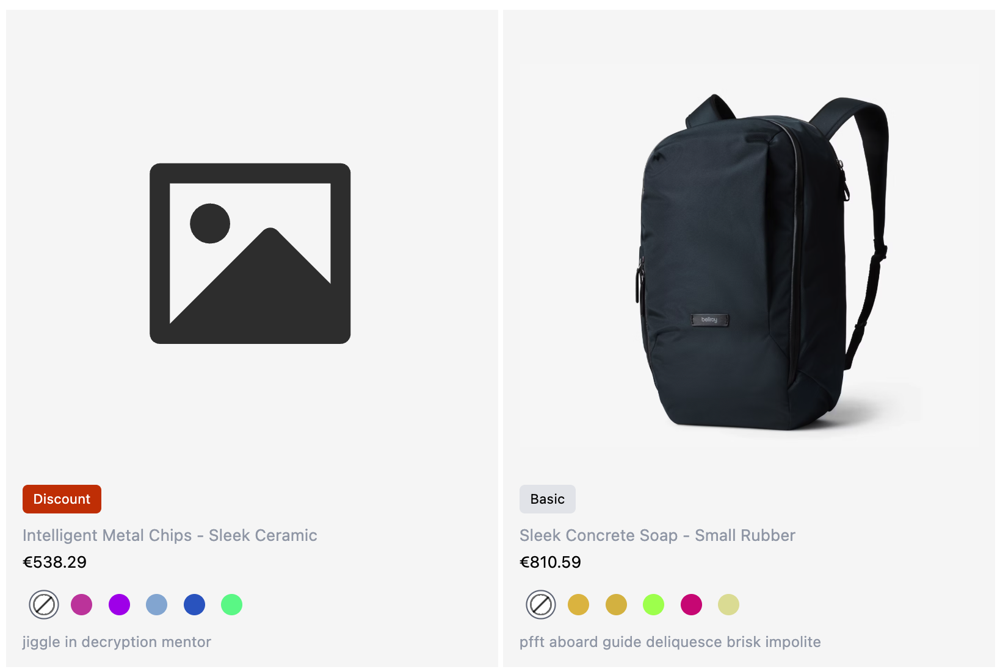
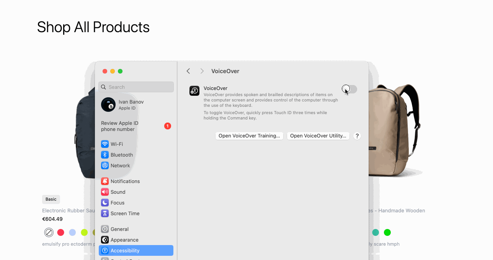
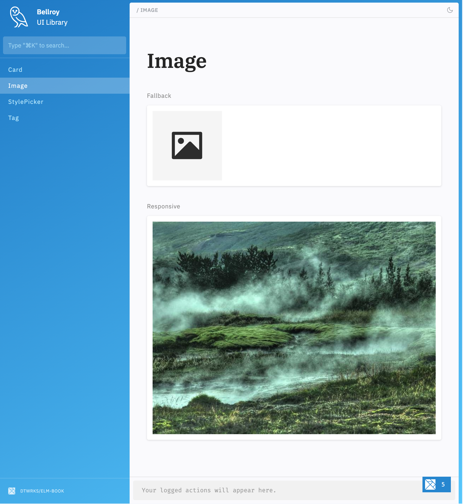

# Bellroy

Elm project using Vite for the bundling and Express to mock the back-end.

## Try it out
1. Clone this project
```
git clone git@github.com:ivanbanov/bellroy.git
```

2. Install all dependencies
```
pnpm install
```

3. Run the back-end mock server
```
pnpm backend
```

4. Run the dev server
```
pnpm elm:dev
```

The mock server will load random items and simulate loading delay a realworld UX.
The products options are simulated with "tinted" images for the simplicity of the project.

Access [http://localhost:5173/](http://localhost:5173/)

## Storybook (elm-book)

```
pnpm storybook
```

## Features

### Responsive layout

The layout looks great on all screen sizes, from mobile to desktop.


### Image load error handler

Reliable UI, even if an image fails to load, a placeholder will be shown. No broken layouts, no crashes.




### Accessibility

Full keyboard support and proper ARIA attributes for screen readers.



### Mini UI libray

Isolated, reusable views, crafted in a sandbox for smooth development and clear docs.


